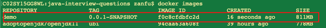
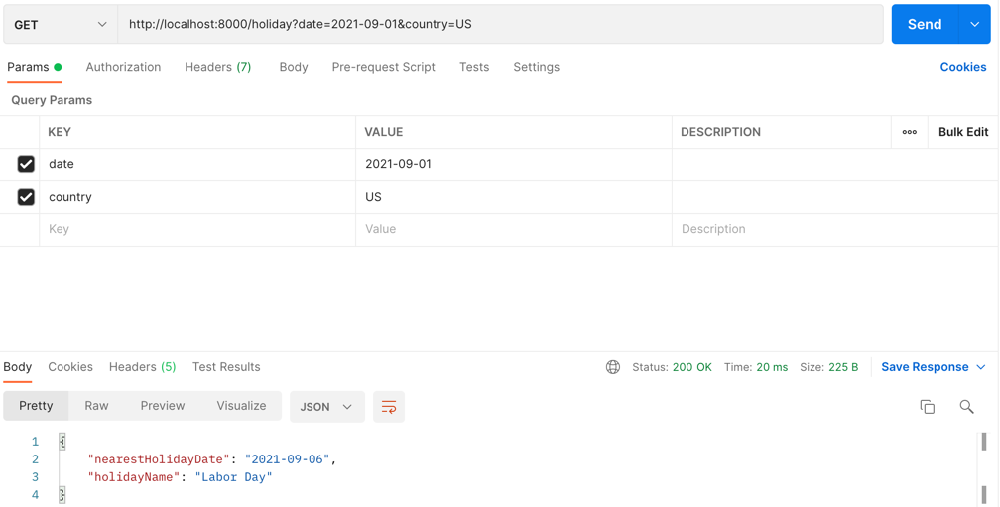
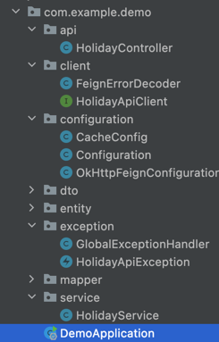

# Holiday API Serivce
## 

A service will return the nearest holiday info by given date.

- Holiday.com as backend API provider
- SpringBoot as web framework, SpringBoot version 2.7.2
- Java version 11.0.15
- mvn version 3.2.5

## How to run

Project is using Spotify docker plugin to build the image. docker deamon needed. 

####Docker version:
- Version:           19.03.5
- API version:       1.40


### Steps

- Maven build jar and docker image. Use maven profile docker-image.

```sh
mvn clean install -Pdocker-image
```

- After that, we can verify the image build.

```sh
docker images
```
like below:



- Run docker images.
```sh
docker run -d -p 8000:50000 -e "backbase.holiday.api.key=<please check my email, i attached in the thread>" -t demo:0.0.1-SNAPSHOT
```

- Open Postman/Brower to verify the result.
  Service is running on 8000 port, and can take two parameters, one is country, the other is date.
  Country is must have, date is optional. 


```sh
http://localhost:8000/holiday?country=US

http://localhost:8000/holiday?country=US&date=2021-09-01
```

 


## Project Structure

Project is a controller -- service -- api three layered architect.

below are the major classes and its responsibility.



- [HolidayController] - Receives two parameters, and validate them
- [HolidayService] - Service layer, rely on Feign client.
- [HolidayApiClient] - Feign client which talks to Holiday.com API provider.
- [CacheConfig and OkHttpFeignConfiguration] - Cached results from Api provider and using connection pool for Feign.
- [GlobalExceptionHandler] - Deals the exception globally, and wrap them into ValidationExceptionMessage/HolidayError etc.
